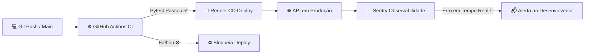

# 🚀 Deploy Automatizado com CI/CD e Monitoramento Contínuo

[](https://github.com/IsaacFelipe/Deploy-automatizado-com-CI-CD-e-monitoramento/actions/workflows/ci.yml)


Uma API construída com **FastAPI** implementando um ciclo completo de **DevOps moderno**: testes automatizados via **GitHub Actions (CI)**, deploy contínuo no **Render (CD)** e monitoramento de erros e observabilidade em tempo real com **Sentry**.

---

## 🌐 Deploy em Produção

A API está publicada e em operação na nuvem:

* **Aplicação ao vivo:** [https://deploy-automatizado-com-ci-cd-e.onrender.com](https://deploy-automatizado-com-ci-cd-e.onrender.com)
* **Documentação interativa (Swagger UI):** [https://deploy-automatizado-com-ci-cd-e.onrender.com/docs](https://deploy-automatizado-com-ci-cd-e.onrender.com/docs)
* **Health Check (Status da API):** [https://deploy-automatizado-com-ci-cd-e.onrender.com/saudável](https://deploy-automatizado-com-ci-cd-e.onrender.com/saudável)

---

## 🏗️ Arquitetura e Fluxo do Pipeline

O pipeline foi desenhado para garantir qualidade de código antes de qualquer publicação e visibilidade total após o deploy:



1. **Desenvolvimento Local:** O código é alterado e versionado via Git.
2. **CI (Integração Contínua):** A cada `push`, o **GitHub Actions** sobe uma máquina virtual Ubuntu, instala as dependências e roda os testes automatizados com **Pytest**.
3. **CD (Entrega Contínua):** Com os testes aprovados, o **Render** constrói a imagem e publica a nova versão em produção sem tempo de inatividade.
4. **Monitoramento (Observabilidade):** O **Sentry SDK** roda acoplado à aplicação, capturando exceções, contexto de requisição e telemetria instantaneamente.

---

## 📋 Endpoints da API

| Método | Rota | Descrição |
| :---: | :--- | :--- |
| `GET` | `/` | Endpoint raiz com status básico da API |
| `GET` | `/saudável` | Endpoint de verificação de integridade (Health Check) |
| `GET` | `/docs` | Documentação interativa automática (OpenAPI / Swagger) |
| `GET` | `/redoc` | Documentação alternativa detalhada (ReDoc) |

> **Nota sobre a rota de teste:** O endpoint `/erro` foi utilizado para validar o disparo de exceções (`ZeroDivisionError`) e homologação dos alertas no Sentry, tendo sido desativado em produção por boas práticas de segurança.

---

## 🛠️ Tecnologias Utilizadas

* **Linguagem & Framework:** [Python](https://www.python.org/) & [FastAPI](https://fastapi.tiangolo.com/)
* **Servidor ASGI:** [Uvicorn](https://www.uvicorn.org/)
* **Testes Automatizados:** [Pytest](https://docs.pytest.org/) & `fastapi.testclient`
* **Integração Contínua (CI):** [GitHub Actions](https://github.com/features/actions)
* **Deploy e Hospedagem (CD):** [Render](https://render.com/)
* **Monitoramento & APM:** [Sentry](https://sentry.io/)

---

## 💻 Como Executar Localmente

### 1. Clonar o repositório
```bash
git clone https://github.com/IsaacFelipe/Deploy-automatizado-com-CI-CD-e-monitoramento.git
cd Deploy-automatizado-com-CI-CD-e-monitoramento
```

### 2. Instalar dependências
```bash
pip install -r requirements.txt
pip install pytest
```

### 3. Rodar os testes automatizados
```bash
pytest
```

### 4. Iniciar o servidor de desenvolvimento
```bash
uvicorn main:app --reload
```
Acesse `http://127.0.0.1:8000/docs` para visualizar e interagir com os endpoints.

---

## 👨‍💻 Autor

Desenvolvido por **Isaac Felipe**  
* Projeto prático de CI/CD, deploy automatizado e monitoramento para portfólio.
